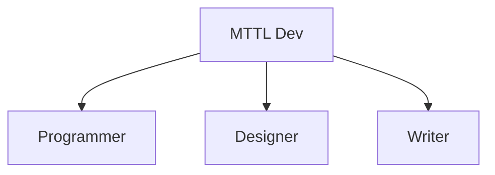
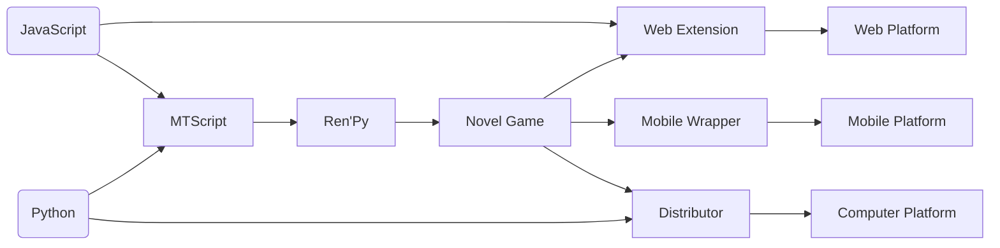

# MTTLDev

Welcome to MTTLDev!

# 組織構成

# プログラムの構成

# よく使われる言語

## Python
Ren'Pyのサポート言語のため使用。  
MTScriptのコンパイラ作成にも使用。

## JavaScript
クライアントサイドとしてのJavaScriptを使用。  
MTScriptのコンパイラや、Web Extensionの作成に使用。

## MTScript
Ren'Pyでのストーリー作成をより容易にするために開発されたトランスパイル型の独自言語。  
なお、言語の定義は曖昧なものとする。

## Ren'Py Script
ゲーム内のデザインやゲームのストーリー外のプログラムを作成する為に使用。

## Go
実行のし易さを活かし、セットアップ用プログラムの開発などに使用。
